# ngEHTexplorer
An interactive tool with which to explore the possible imaging performance of candidate ngEHT architectures.

- [Summary](#Summary-Description)
- [Getting started](#Getting-Started)
- [Feature Tour](#Feature-Tour)

## Summary Description
ngEHTexplorer is an interactive "app" that enables you to explore the impact of different ngEHT architecture choices on image reconstructions.  It is possible to investigate:
- performance of different arrays (incl. add/remove stations)
- imaging at multiple frequecies (incl. simultaneous multi-freq.)
- the impact of receiver bandwidth
- the impact of ngEHT dish size
- performance over different observation times and duration
- performance for different target sky positions
- performancce on various source images (incl. your own!)

and combinations thereof.

## Getting Started
To run ngEHTexplorer:
1. Clone the ngEHTexplorer github repository:
> $ git clone https://github.com/aeb/ngEHTexplorer.git
2. Descend into the ngEHTexplorer directory:
> $ cd ngEHTexplorer
3. Run the executable:
> $ ./ngEHTexplorer

You may need to edit the top of ngEHTexplorer to set the executables for your python3 and pip3 installations.

## Requirements
ngEHTexplorer is built with Python.  To run ngEHTexplorer requries:
- Python3 (3.7 or later)
- kivy
- kivymd
- matplotlib
- numpy
You can normally install these (locally) with pip:
> $ pip3 install --upgrade kivy kivymd matplotlib numpy --user

## Feature Tour
On start up, you should see the "quickstart" source selection screen:

     &emsp; 

The navigation drawer (circled above) is the primary way to move through the various features of the app.  The app will intially start in "Quickstart" mode, which has a reduced set of features.  To enter "Expert mode", open the navigation drawer and select the switch at the top.

     &emsp; 

From thet navigation drawer you can select a variety of screens.  We begin with the Target screen, which permits selecting the sky position of interest.  Specific sources are listed in the menu in the lower-right (currently "Sgr A*"), included "--Select--" which permits the selection of arbitrary positions.  The map is in celestial coordinates.

     &emsp; 

We now turn to the Source screen, which permits selecting the source image.  Options include the source itself (dragging left/right on teh image), the field of view of the image shown, total flux in the image, and observation frequency.  

     &emsp; 

It is possible to simulate multi-frequency observations, i.e., observations in which multiple frequencies are reconstructed simultaneously, assuming perfect phase transfer among them.  To do this, select the "Multi-freq." switch, and set the upper and lower frequency range.

   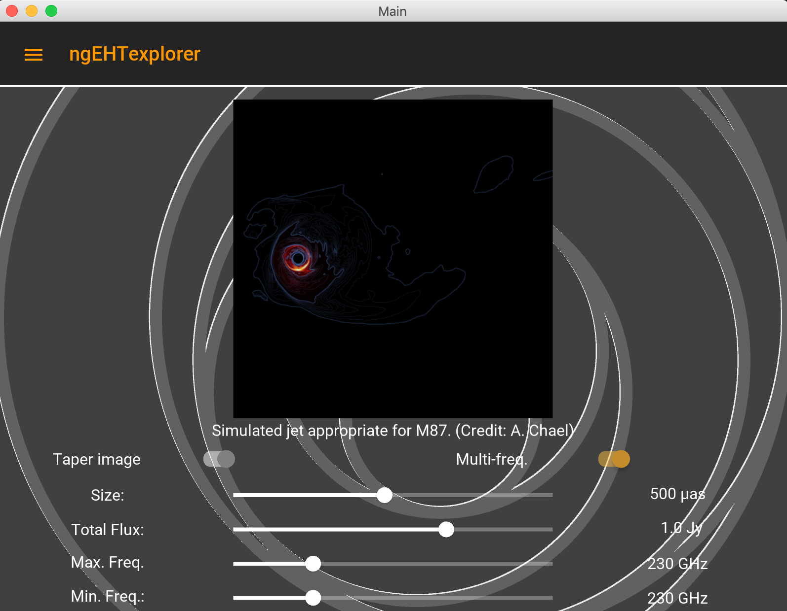  &emsp; 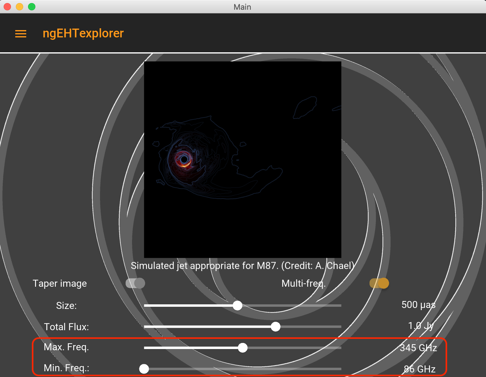

The global positions of the array can be visualized on the "Array" screen.  The map can be scrolled (mouse) and zoomed (+/-) in the normal way.

   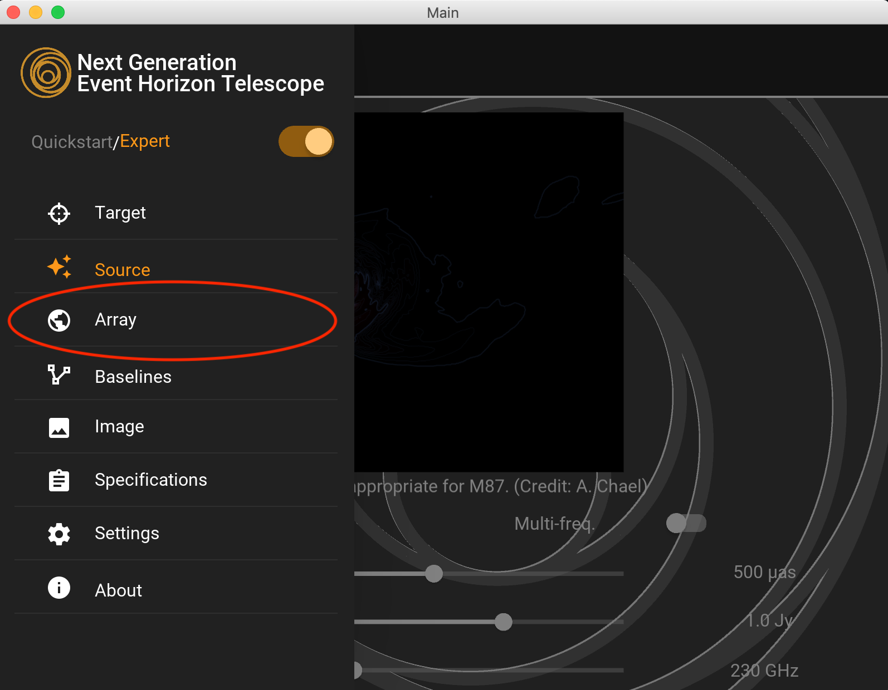 &emsp; 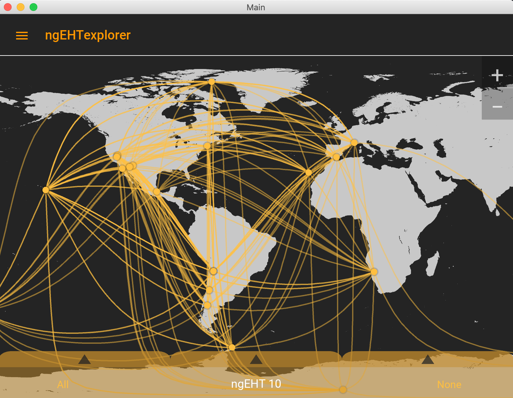

Different arrays can be selected (also on the "Baselines" and "Image" screeens) by selecting the array name.  Selecting "ngEHT+" allows adding arbitrary additional array locations.

    &emsp; 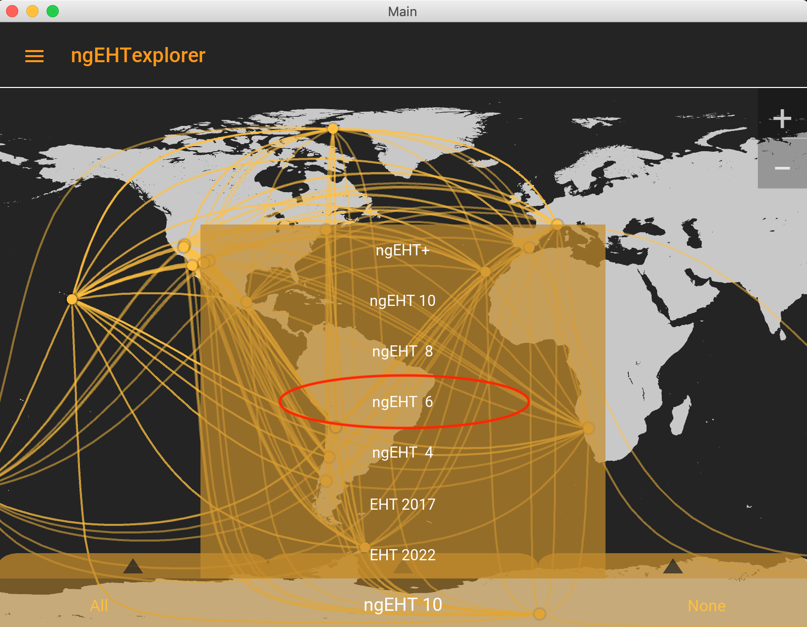 &emsp; 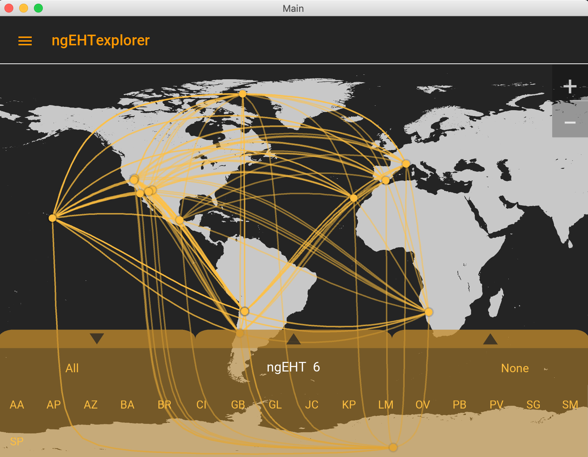

The "uv coverage" of the desired array can be visualized on the "Baselines" screen.  A number of submenus can be opened, permitting the selection/deselection of individual stations, observation time ranges, ngEHT antenna diameters, and bandwidths.  The current screen will be updated automatically as these options are adjusted, which makes it possible to explore the deependence of these parameters in real time.  The plot can be scrolled (mouse) and zoomed (+/-) in the normal way.

   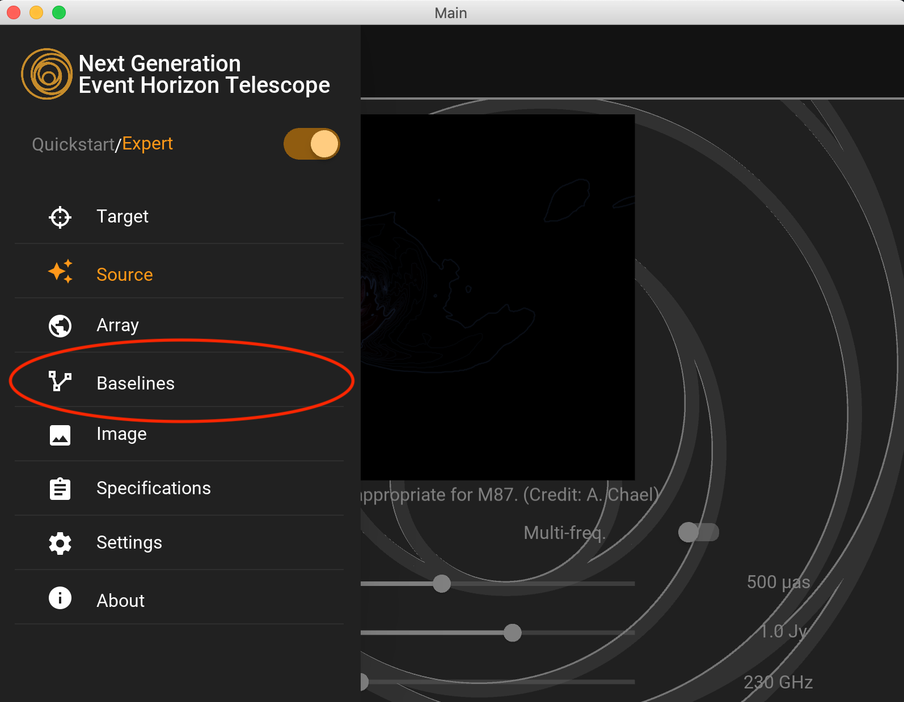 &emsp; 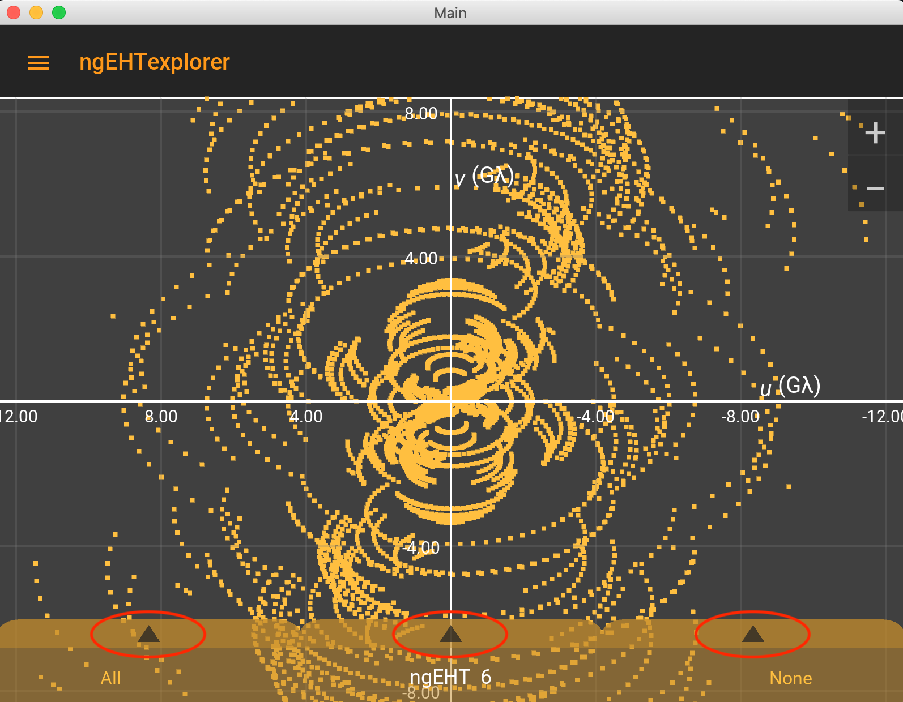 &emsp; 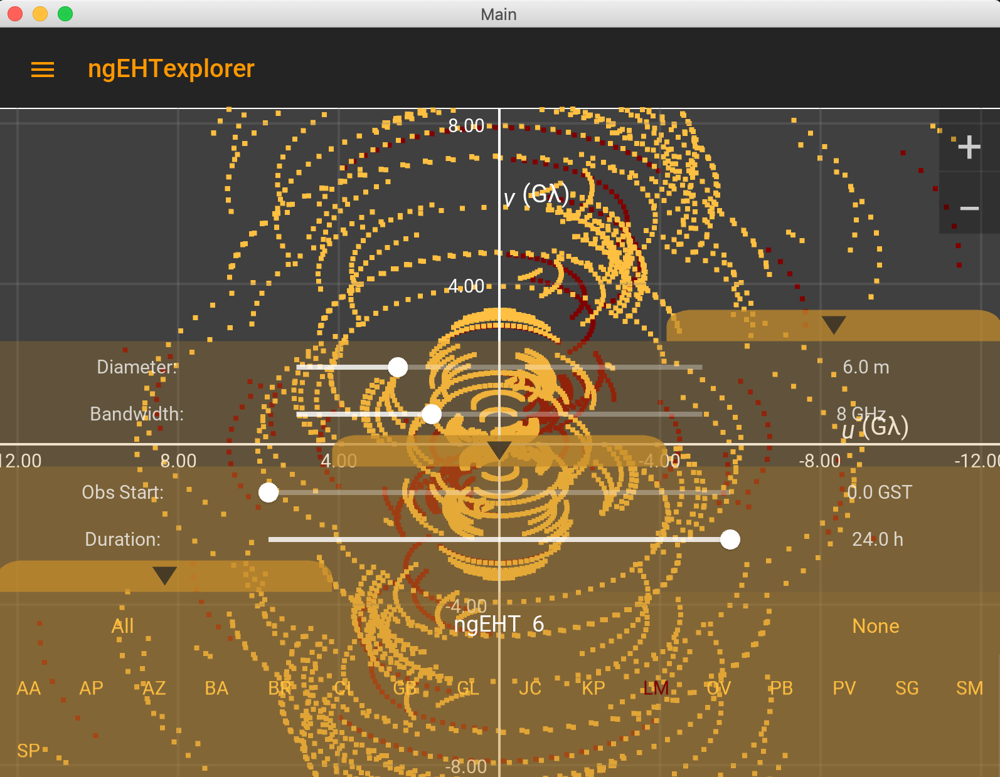

The image associated with the selected target location, source image, and array is shown in the "Image" screen.  Image reconstruction is done in real time.  The colormap shows the image with a linear transfer function; contours indicate a logarithmic transfer function with thick contours denoting factors of 10 below the maximum brightness.  The image can be scrolled (mouse) and zoomed (+/-) in the normal way.

   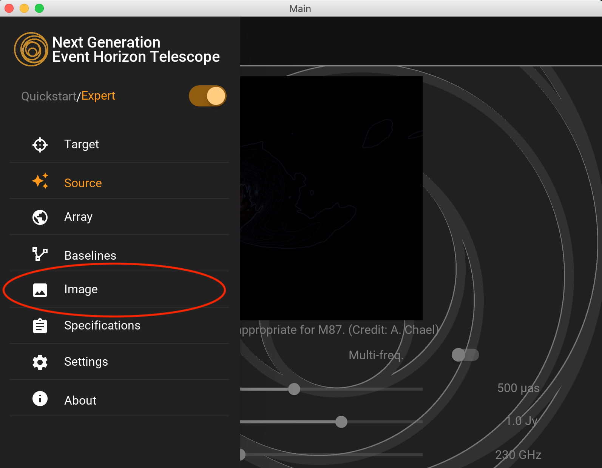 &emsp; 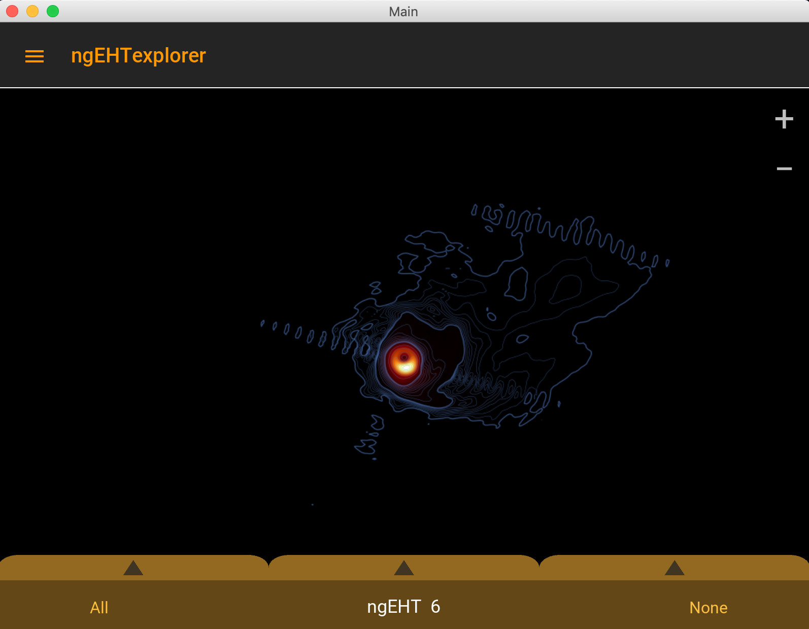

Specifications, including array performance metrics are included on the "Specifications" screen.  These are updated as the options on the other screens are modified.

   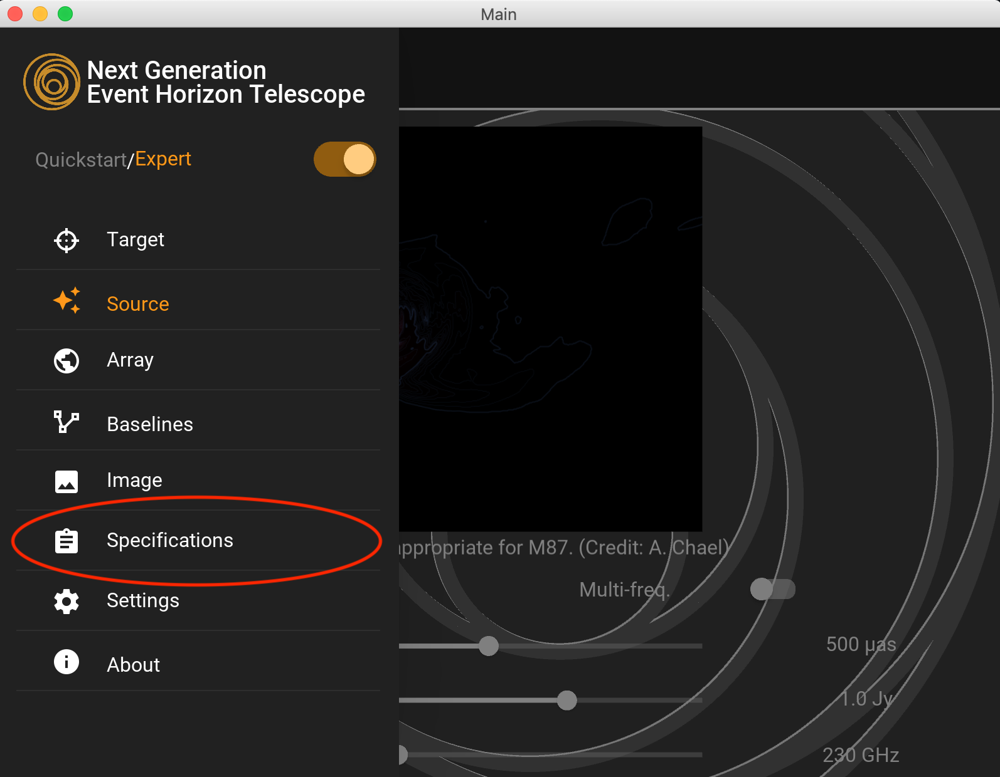 &emsp; 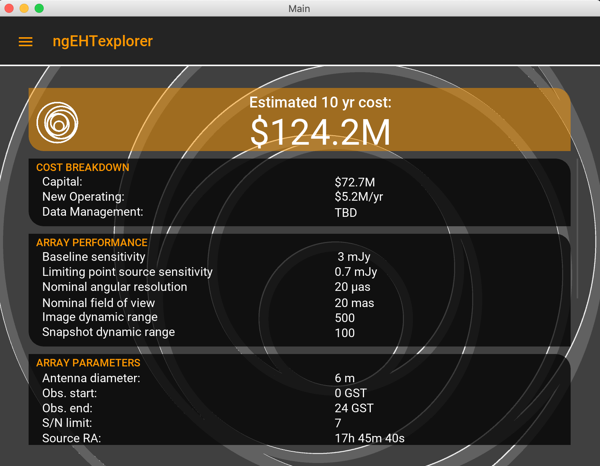

Finally, various settings can be found on the "Settings" screen and information about the ngEHT and the development team can be found on the "About" screen.  Happy exploring!

