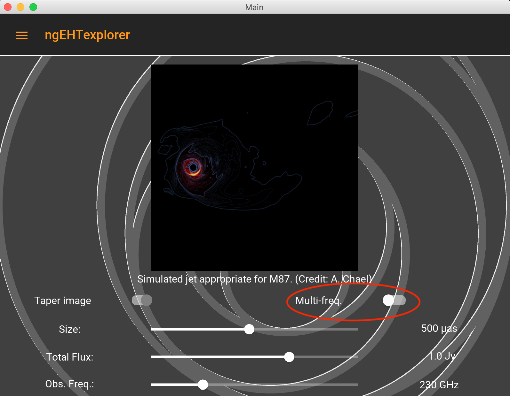

# ngEHTexplorer
An interactive tool with which to explore the possible imaging performance of candidate ngEHT architectures.

- [Summary Description](#Summary-Description)
- [Getting Started](#Getting-Started)
- [Feature Tour](#Feature-Tour)

## Summary Description
ngEHTexplorer is an interactive "app" that enables you to explore the impact of different ngEHT architecture choices on image reconstructions.  It is possible to investigate:
- performance of different arrays (incl. add/remove stations)
- imaging at multiple frequecies (incl. simultaneous multi-freq.)
- the impact of receiver bandwidth
- the impact of ngEHT dish size
- performance over different observation times and duration
- performance for different target sky positions
- performancce on various source images (incl. your own!)

and combinations thereof.

## Getting Started
To run ngEHTexplorer on Mac OSX, Linux, or other POSIX systems:
1. Clone the ngEHTexplorer github repository:
> $ git clone https://github.com/aeb/ngEHTexplorer.git
2. Descend into the ngEHTexplorer directory:
> $ cd ngEHTexplorer
3. Run the executable:
> $ ./ngEHTexplorer

To run ngEHTexplorerr on Windows you may need to run the python script manually:
1. Clone the ngEHTexplorer github repository:
> $ git clone https://github.com/aeb/ngEHTexplorer.git
2. Descend into the ngEHTexplorer/src directory:
> $ cd ngEHTexplorer/src
3. Run the executable:
> $ python3 main.py

You may need to edit the top of ngEHTexplorer to set the executables for your python3 and pip3 installations.

## Requirements
ngEHTexplorer is built with Python.  To run ngEHTexplorer requries:
- Python3 (3.7-9; some conflicts with 3.10 have been reported)
- kivy
- kivymd
- matplotlib
- numpy

You can normally install these (locally) with pip:
> $ pip3 install --upgrade kivy kivymd matplotlib numpy --user

## Feature Tour
Upon starting ngEHTexplorer, you should see a source selection screen:

     &emsp; 

The navigation drawer (circled above) is the primary way to move through the various features of the application.  The application will intially be in "Quickstart" mode, which has a reduced set of features.  To enter "Expert mode", open the navigation drawer and select the switch at the top (circled below).

     &emsp; 

From the navigation drawer a variety of screens may be selected.  We begin with the Target screen, which permits selecting the sky position of interest.  Sky positions of a number of specific sources are listed in the menu in the lower-right (currently set to "Sgr A*").  Among these choices is "--Select--", which permits the selection of arbitrary sky positions with the mouse.  The sky map can be scrolled (mouse) and zoomed (+/-) in the normal way.

     &emsp; 

The Source screen permits selecting among various source images, including your own.  Options include the source image itself (dragging left/right on the image), the angular size of the image, total flux in the image, and observation frequency.  

     &emsp; 

It is possible to simulate multi-frequency observations, i.e., observations in which multiple frequencies are reconstructed simultaneously (assuming perfect phase transfer).  To do this, select the "Multi-freq." switch, and set the maximum and minimum frequency (e.g., 345 GHz and 86 GHz).

     &emsp; 

The Array screen provides a visualization of the global position of array stations.  The map can be scrolled (mouse) and zoomed (+/-) in the normal way.

    &emsp; 

Different arrays can be selected (also on the Baselines and Image screeens) by selecting the array name.  Selecting "ngEHT+" allows the addition of arbitrary new array locations.

    &emsp;  &emsp; 

The Baselines screen provides a visualization of the "uv coverage" of the selected array.  A number of submenus can be opened, permitting the selection/deselection of individual stations, observation time ranges, ngEHT antenna diameters, and bandwidths.  The current screen will be updated automatically as these options are adjusted, which makes it possible to explore the dependence of these parameters in real time.  The plot can be scrolled (mouse) and zoomed (+/-) in the normal way.

    &emsp;  &emsp; 

The Image screen presents the image reconstructed (in real time) from the simulated ngEHT data generated from the selected target location, source image, and array configuration.  The colormap shows the image with a linear transfer function; contours indicate a logarithmic transfer function with thick contours denoting factors of 10 below the maximum brightness.  The image can be scrolled (mouse) and zoomed (+/-) in the normal way.

    &emsp; 

The Specifications screen presents various statistics associated with the array, simulated data sets, and reconstruction, including array performance metrics.  These are updated as the options on the other screens are modified.

    &emsp; 

Finally, various settings can be found on the Settings screen and information about the ngEHT and the development team can be found on the About screen.

Happy exploring!

