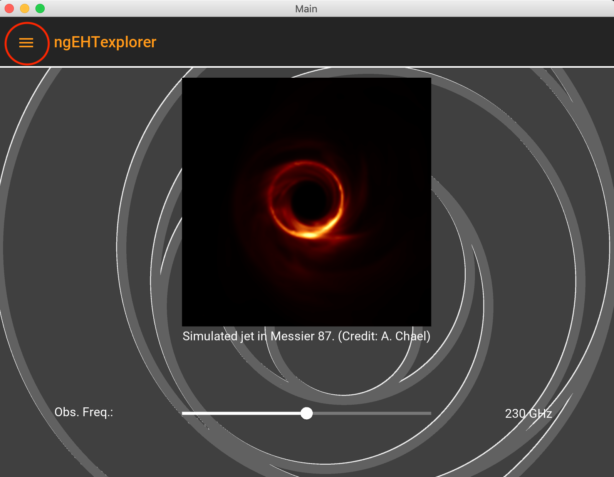
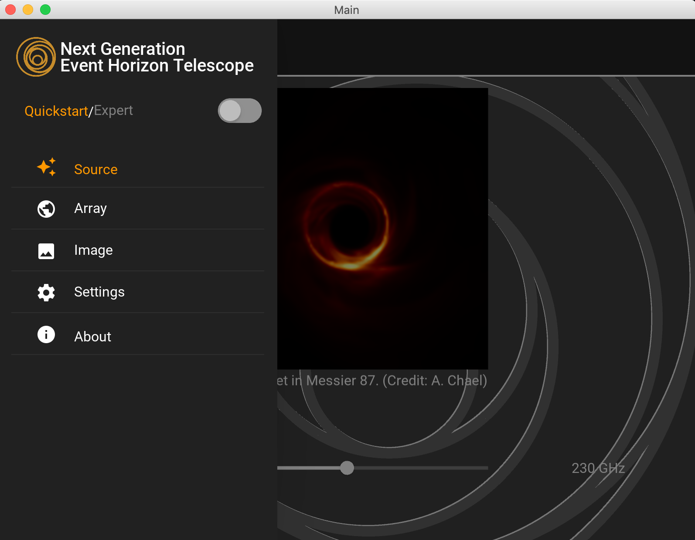
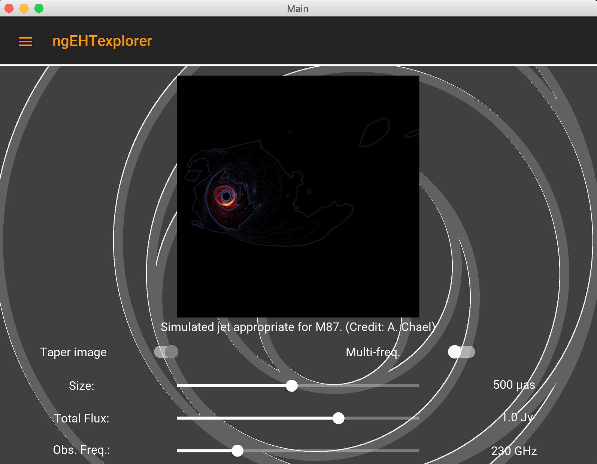

# ngEHTexplorer
An interactive tool with which to explore the possible imaging performance of candidate ngEHT architectures.

## Welcome!
ngEHTexplorer is an interactive "app" that enables you to explore the impact of different ngEHT architecture choices on image reconstructions.  It is possible to investigate:
- performance of different arrays (incl. add/remove stations)
- imaging at multiple frequecies (incl. simultaneous multi-freq.)
- the impact of receiver bandwidth
- the impact of ngEHT dish size
- performance over different observation times and duration
- performance for different target sky positions
- performancce on various source images (incl. your own!)

and combinations thereof.

## Getting Started
To run ngEHTexplorer:
1. Clone the ngEHTexplorer github repository:
> $ git clone https://github.com/aeb/ngEHTexplorer.git
2. Descend into the ngEHTexplorer directory:
> $ cd ngEHTexplorer
3. Run the executable:
> $ ./ngEHTexplorer

You may need to edit the top of ngEHTexplorer to set the executables for your python3 and pip3 installations.

## Requirements
ngEHTexplorer is built with Python.  To run ngEHTexplorer requries:
- Python3 (3.7 or later)
- kivy
- kivymd
- matplotlib
- numpy
You can normally install these (locally) with pip:
> $ pip3 install --upgrade kivy kivymd matplotlib numpy --user

## Tour
On start up, you should see the "quickstart" source selection screen:

     &emsp; 

The navigation drawer (circled above) is the primary way to move through the various features of the app.  The app will intially start in "Quickstart" mode, which has a reduced set of features.  To enter "Expert mode", open the navigation drawer and select the switch at the top.

     &emsp; 

From thet navigation drawer you can select a variety of screens.  We begin with the Target screen, which permits selecting the sky position of interest.  Specific sources are listed in the menu in the lower-right (currently "Sgr A*"), included "--Select--" which permits the selection of arbitrary positions.  The map is in celestial coordinates.

     &emsp; 

We now turn to the Source screen, which permits selecting the source image.  Options include the source itself (dragging left/right on teh image), the 

sky position of interest.

     &emsp; 

